# Programacion orientada a objetos (POO)

Análisis de los objetos, clases y métodos de la aplicación Uber

Para resolver un problema como desarrollador es de gran utilidad dividirlo en subproblemas y generar un modelo que te permita implementar las soluciones en código. A lo largo de este curso vas a analizar Uber, una de las aplicaciones más usadas en el mundo, para entender cómo está construida. A partir de este análisis harás la extracción y definición de los objetos, clases y métodos que conforman la aplicación, usarás UML para modelarla y, finalmente, usando diferentes lenguajes como Java, PHP y Python harás la implementación de las clases y objetos de la aplicación.

[Clase 1 ¿Por qué aprender Programación Orientada a Objetos?](#Clase-1-¿Por-qué-aprender-Programación-Orientada-a-Objetos?)

[Clase 2 ¿Qué resuelve la Programación Orientada a Objetos?](#Clase-2-¿Qué-resuelve-la-Programación-Orientada-a-Objetos?)

[Clase 3 Paradigma Orientado a Objetos](#Clase-3-Paradigma-Orientado-a-Objetos)

[Clase 4 Lenguajes Orientados a Objetos](#Clase-4-Lenguajes-Orientados-a-Objetos)

[Clase 5 Instalando Visual Studio Code](#Clase-5-Instalando-Visual-Studio-Code)

[Clase 6 Diagramas de Modelado](#Clase-6-Diagramas-de-Modelado)

[Clase 7 UML](#Clase-7-UML)

[Clase 8 Objetos](#Clase-8-Objetos)

[Clase 9 Abstracción y Clases](#Clase-9-Abstracción-y-Clases)

[Clase 10 Modularidad](#Clase-10-Modularidad)

[Clase 11 Analizando Uber en Objetos](#Clase-11-Analizando-Uber-en-Objetos)

[Clase 12 Reto 1: identificando objetos](#Clase-12-Reto-1-identificando-objetos)

[Clase 13 Clases en UML y su sintaxis en código](#Clase-13-Clases-en-UML-y-su-sintaxis-en-código)

[Clase 14 Modelando nuestros objetos Uber](#Clase-14-Modelando-nuestros-objetos-Uber)

[Clase 15 ¿Qué es la herencia?](#Clase-15-¿Qué-es-la-herencia?)

[Clase 16 Aplicando Herencia a nuestro proyecto Uber](#Clase-16-Aplicando-Herencia-a-nuestro-proyecto-Uber)

[Clase 17 Reto 2: analicemos un problema](#Clase-17-Reto-2-analicemos-un-problema)

[Clase 18 Definiendo clases en Java y Python](#Clase-18-Definiendo-clases-en-Java-y-Python)

[Clase 19 Definiendo Clases en JavaScript](#Clase-19-Definiendo-Clases-en-JavaScript)

[Clase 20 Objetos, método constructor y su sintaxis en código](#Clase-20-Objetos-método-constructor-y-su-sintaxis-en-código)

[Clase 21 Objetos. Dando vida a nuestras clases en Java y Python](#Clase-21-Objetos-Dando-vida-a-nuestras-clases-en-Java-y-Python)

[Clase 22 Declarando un Método Constructor en Java y JavaScript](#Clase-22-Declarando-un-Método-Constructor-en-Java-y-JavaScript)

[Clase 23 Declarando un Método Constructor en Python](#Clase-23-Declarando-un-Método-Constructor-en-Python)

[]()

[]()

[]()

[]()

## Clase 1 ¿Por qué aprender Programación Orientada a Objetos?

- **Vas a programar más rápido**. Tener un análisis previo de lo que estás realizando te ayudará a generar código mucho más veloz

- **Dejas de ser Programador Jr**. Podrás responder preguntas como ¿Qué es encapsulamiento?, ¿Qué es Abstracción?, ¿Qué es Herencia?, ¿Qué es Polimorfismo? en futuras entrevistas de trabajo

- **Dejar de Copiar y Pegar Código**

Con este curso se aprende a:

- Analizar codigo y problemas mediante observación, entendimiento y lectura

- Plasmar a traves de diagramas

- Programar en distintos lenguajes de programacion orientados a objetos

## Clase 2 ¿Qué resuelve la Programación Orientada a Objetos?

La programación Orientada a Objetos nace de los problemas creados por la programación estructurada y nos ayuda a resolver cierto problemas como:

- Código muy largo: A medida que un sistema va creciendo y se hace más robusta el código generado se vuelve muy extenso haciéndose difícil de leer, depurar, mantener.

- Si algo falla, todo se rompe: Ya que con la programación estructurada el código se ejecuta secuencialmente al momento de que una de esas líneas fallara todo lo demás deja de funcionar.

- Difícil de mantener.

- Codigo Espagueti. evitar condicionales anidados que en algun punto se pueden romper o caer en un ciclo si no se sabe claramente lo que se habia realizado y cantidad de lineas de codigo que hace dificil encontrar problemas en el momento que llegue a surgir uno.

## Clase 3 Paradigma Orientado a Objetos

La **Programación Orientada a Objetos** viene de las siglas **(POO)** o **(OOP(Object oriented Programming))**, la cual viene de una filosofía o forma de pensar que es la **Orientación a Objetos** y esto surge a partir de los problemas que necesitamos plasmar en código.

Es analizar un problema en forma de objetos para después llevarlo a código, eso es la **Orientación a Objetos**.


La Programacion orientada a objetos es un **paradigma** la cual es una teoría que suministra la base y modelo para resolver problemas. 

El paradigma de Programación Orientada a Objetos se compone de 4 elementos:

- Clases

- Propiedades

- Métodos

- Objetos

Y 4 Pilares:

- Encapsulamiento

- Abstracción

- Herencia

- Polimorfismo

## Clase 4 Lenguajes Orientados a Objetos

Algunos de los lenguajes de programación Orientados a Objetos son:


Lo mas importante mas alla del lenguaje que se escoja es aprender a programar.

Es recomendable no solo especializarse en un solo lenguaje, el saber programar y conocer los diferentes paradigmas de programacion ayudan a entender otros lenguajes, de esta forma en el futuro no existira algun problema de adaptabilidad y siempre es recomendable apoyarse de la documentacion de cada lenguaje, existen foros y diferentes medios donde se pueden consultar dudas que le suceden a los programadores, una de las paginas mas populares es [stackoverflow](https://es.stackoverflow.com/).

A continuacion una descripcion corta de los lenguajes de programacion orientados a objetos:

- Java:

    – Orientado a Objetos naturalmente

    – Es muy útilizado en Android

    – Es usado del lado del servidor o Server Side
    
- PHP

    – Lenguaje interpretado

    – Pensado para la Web
    
- Python

    – Diseñado para ser fácil de usar

    – Múltiples usos: Web, Server Side, Análisis de Datos, Machine Learning, etc


- Javascript

    – Lenguaje interpretado

    – Orientado a Objetos pero basado en prototipos

    – Pensado para la Web

- C#

- Ruby

- Kotlin

## Clase 5 Instalando Visual Studio Code

Pues que comience la aventura y digo aventura porque te darás cuenta de lo emocionante que será poder trabajar 4 lenguajes de programación en un solo entorno de desarrollo y sí, precisamente eso es lo que nos resuelve Visual Studio Code el cual será nuestro campeón en este curso.

Visual Studio Code lo puedes encontrar en las tres versiones básicas de Sistema Operativo (Windows, Mac y Linux) y lo puedes descargar directo en este enlace: https://code.visualstudio.com/download. Es muy ligero y basta con un Siguiente, siguiente, siguiente para instalar.


Cuando la instalación haya finalizado verás algo como esto:


¡Súper! Todo salió bien. Ahora pasemos a configurarlo para cada lenguaje.

Primero ubica la sección de **Extensiones** o en inglés **Extensions**, además de la barra de Search porque estaremos buscando la extensión para cada lenguaje.


**Java**
___

En la barra de Search Extensions escribe: **Java Extension Pack** y da clic en el botón verde **Install**.


Ahora, para tener una mejor experiencia en Debugging, instala el Debugger for Java, el cual encuentras siguiendo el procedimiento anterior.

Listo, terminamos con Java. Aprende más en este enlace: https://code.visualstudio.com/docs/languages/java

Ahora vamos por Python.

**Python**
___

Comencemos instalando Python en nuestra computadora. Dirígete al sitio python.org y dale clic en el botón de Descargar.


Ve de la mano con el asistente hasta finalizar la instalación:


Terminaremos la configuración de Python en Visual Studio Code más adelante. Aprende más [aquí](https://code.visualstudio.com/docs/python/python-tutorial).

Mientras tanto sigamos con PHP.

**PHP**
___

Para configurar PHP buscaremos la extensión** PHP Server** y pulsamos Instalar


**JavaScript**
___

En este caso no necesitamos instalar absolutamente nada, utilizaremos el editor con su configuración por defecto.

**Comencemos nuestro proyecto**
___

Ya está todo listo, ahora dejemos creado el proyecto.

Para esto seleccionaremos la opción **Add workspace folder**


A continuación creamos una carpeta llamada **CursoPOOUber** y damos clic en Add para finalizar. Ahora generemos esta estructura de carpetas para manejar los documentos correspondientes al lenguaje de programación:


## Clase 6 Diagramas de Modelado

Son las herramientas necesarias para realizar el analisis necesario e implementar la forma en que se va a estructurar el programa a realizar mediante **POO**

**OMT:** Object Modeling Techniques. Creado en 1191, es una metodología para el análisis orientado a objetos. Lo que propone es que una vez ya esta hecho el analisis, identificacion de objetos, atributos, metodos y ya estan nombrados los objetos.

Dice la metodologia que se empiecen a implementar en un cuadro y con una serie de conectores se empieza a definir la relacion que tiene uno con otro:


**UML:** Unified Modeling Language o Lenguaje de Modelado Unificado. Creado en 1197, Tomó las bases y técnicas de OMT unificándolas. Tenemos más opciones de diagramas como lo son Clases, Casos de Uso, Objetos, Actividades, Iteración, Estados, Implementación.

Para un proyecto donde se pide una aplicacion con programacion orientada a objetos este es el grafico que representa la forma en como se puede entregar la cual se vera mas adelante


**Nota:** Las tecnicas que se deben seguir en la actualidad son **UML**, OMT ya quedo descontinuado

## Clase 7 UML

Como ya viste UML significa Unified Modeling Language el cual es un lenguaje estándar de modelado de sistemas orientados a objetos.


Esto significa que tendremos una manera gráfica de representar una situación, justo como hemos venido viendo. A continuación te voy a presentar los elementos que puedes utilizar para hacer estas representaciones.

Las clases se representan así:


En la parte superior se colocan los atributos o propiedades, y debajo las opera ciones de la clase. Notarás que el primer caracter con el que empiezan es un símbolo. Este denotará la visibilidad del atributo o método, esto es un término que tiene que ver con Encapsulamiento y veremos más adelante a detalle.

Estos son los niveles de **visibilidad** que puedes tener:

- private
+ public
# protected
~ default

Una forma de representar las relaciones que tendrá un elemento con otro es a través de las flechas en UML, y aquí tenemos varios tipos, estos son los más comunes:

**Asociación**
___


Como su nombre lo dice, notarás que cada vez que esté referenciada este tipo de flecha significará que ese elemento contiene al otro en su definición. La flecha apuntará hacia la dependencia.


Con esto vemos que la ClaseA está asociada y depende de la ClaseB.

**Herencia**
___


Siempre que veamos este tipo de flecha se estará expresando la herencia.
La dirección de la flecha irá desde el hijo hasta el padre.


Con esto vemos que la ClaseB hereda de la ClaseA

**Agregación**
___


Este se parece a la asociación en que un elemento dependerá del otro, pero en este caso será: Un elemento dependerá de muchos otros. Aquí tomamos como referencia la multiplicidad del elemento. Lo que comúnmente conocerías en Bases de Datos como Relaciones uno a muchos.


Con esto decimos que la ClaseA contiene varios elementos de la ClaseB. Estos últimos son comúnmente representados con listas o colecciones de datos.

**Composición**
___


Este es similar al anterior solo que su relación es totalmente compenetrada de tal modo que conceptualmente una de estas clases no podría vivir si no existiera la otra.


Con esto terminamos nuestro primer módulo. Vamos al siguiente para entender cómo podemos hacer un análisis y utilizar estos elementos para construir nuestro diagrama de clases de Uber.

## Clase 8 Objetos

Los Objetos son aquellos que tienen propiedades y comportamientos, también serán sustantivos.

    - Pueden ser Físicos o Conceptuales


Aca un ejemplo de caso de la vida real, un objeto de tipo User o usuario es algo que se puede tocar, que interactua, etc

Un objeto conceptual puede ser una session o sesion de usuario, es algo que no se puede tocar pero si tiene comportamiento y atributos, como hacer login, logout, informar si el usuario esta creado o no, informar si la contraseña esta mal, etc


Las **Propiedades** también pueden llamarse atributos y estos también serán sustantivos. Algunos atributos o propiedades son nombre, tamaño, forma, estado, etc. Son todas las características del objeto.

Para explicar mejor esto no quiere decir que el nombre Jeyfred Calderon sea propiamente el atributo, lo que realmente es el atributo de una clase es **nombre** o que el atributo sea grande, el atributo realmente es **tamaño**

Los **Comportamientos** serán todas las operaciones que el objeto puede hacer, suelen ser verbos o sustantivos y verbo. Algunos ejemplos pueden ser que el usuario pueda hacer `login()` y `logout()`.

**Aqui un ejeḿplo:**

El objeto perro tiene propiedades que a continuacion se listan, pueden ser mas de las que representa la imagen


Ademas de tener estas propiedades o atributos tambien puede tener comportamientos


**otro ejemplo**

Aqui existe un sistema de adopciones, donde la persona ve un catalogo de perros y quiere escoger cual de ellos se quiere llevar 

El catalogo debe tener un identificador, el cual diferencia a uno de los perros de los demas porque pueden tener la misma raza, color, altura, etc, pero realmente el identificador es el que lo va a diferenciar del resto 

En este contexto lo que realmente importa es que el perro sea adoptado por tal razon el comportamiento que se tendra es **ser adoptado** sin tener en cuenta los comportamientos del ejemplo anterior


## Clase 9 Abstracción y Clases

Una **Clase** es el modelo por el cual nuestros objetos se van a construir y nos van a permitir generar más objetos.

Analizamos Objetos para crear **Clases**. Las **Clases** son los modelos sobres los cuales construiremos nuestros objetos.

**Abstracción** es cuando separamos los datos de un objeto para generar un molde.

En el ejemplo anterior se hablaba de un perro que tenia unas propiedades y unos comportamientos.

Pero existen perros de diferentes razas, nombres, colores, etc.

Para esto es la clase para definir de una forma general 


En este caso al perro, todos los perros cuentan con caracteristicas en comun como por ejemplo tener un nombre, raza, color, etc.

Los objetos son elementos de nuestra realidad con los que interactuamos(pueden ser físicos o conceptuales).

Los patrones o aspectos comunes que hallamos al observar objetos similares nos forman un concepto de lo que ese objeto representa para nosotros, como lo percibimos o representamos. La obtención las ideas principales o esencia común de los objetos analizados se llama abstracción; El concepto idealizado, generalizado de dichos objetos viene a ser representado por la “Clase”.

La clase es un modelo del objeto, algo así como un sello o molde y los objetos serían como la estampa o elemento elaborado por el molde; Los objetos son ejemplares de una clase. Entendemos a estas “clases” como dos conjuntos de: atributos o propiedades y comportamientos. (Las clases son sustantivos)

Los atributos (también son sustantivos, generalmente descriptivos) son características o propiedades, rasgos, adjetivos que definen al modelo. Por ejemplo, los atributos de una clase serian: id, nombre, raza, color; y los de un objeto serían: 101, Rocky, Dálmata, Blanco moteado negro.

Los comportamientos también definen la clase o al objeto mediante acciones que puede realizar (por tanto, son verbos o sustantivo_verbo)

El contexto es clave para realizar una abstracción útil que realmente ayude a resolver el problema planteado.

## Clase 10 Modularidad

La **modularidad** va muy relacionada con las clases y es un principio de la Programación Orientado a Objetos y va de la mano con el Diseño Modular que significa dividir un sistema en partes pequeñas y estas serán nuestros módulos pudiendo funcionar de manera independiente.

Un ejemplo de modularidad es construir elementos a traves de modulos en distintas partes, generando cada elemento y luego unificandolo para construir un conjunto de elementos, si en dado caso se quisiera cambiar alguna parte de algun modulo se puede hacer y no tiene porque afectar al resto de los otros modulos


La **modularidad** de nuestro código nos va a permitir

- Reutilizar

- Evitar colapsos

- Hacer nuestro código más mantenible

- Legibilidad

- Resolución rápida de problemas

Una buena práctica es separando las clases en archivos diferentes para generar modularidad.

## Clase 11 Analizando Uber en Objetos

Para resolver un problema es importante dividirlos en pequeños modulos y de aqui parte el problema a analizar de Uber  

1. Todo parte de una necesidad, es necesario contar con un celular y querer trasladarse de un punto A a un B

2. Se solicita un automovil y en la app se seleccion de que punto a que punto se va a trasladar 

3. La app muestra un catalogo de servicios el cual cada uno de ellos tiene un costo por ser servicios diferentes

    - Uber x

    - Uber Pool

    - Uber Black

    - Uber Van

4. Cuando se elige uno de los servicios, el usuario espera que lo recoja el automovil que decidio escoger para prestar el servicio y trasladar del punto A escogido por el usuario al punto B


Ahora lo que hay que realizar es empezar a abstraer los objetos 

**Objetos**

1. User -> Quien solicita al automovil

2. Route -> Necesidad de trasladar de un punto A a un punto B

3. 4 objetos que aparecen. Uber x, Uber Pool, Uber Black, Uber Van

4. Driver -> El cual representa al conductor

5. Card, Paypal, cash -> Las cuales representan la forma en que se va a pagar el servicio al estar completo y finalizado

6. Trip -> Es de tipo conceptual y va a captar quien esta ejecutando el viaje, el lugar de recogida y entrega, ruta del mapa, etc

## Clase 12 Reto 1: identificando objetos

Ya estás listo para resolver tu primer reto y poner en práctica todo lo que aprendiste para identificar objetos en un problema.

Toma como referencia nuestro Sistema de Adopciones e identifica todos los objetos.


1. Existe la necesidad de adoptar un perro, para ello una persona se debe trasladar a las instalaciones fisicas por ejemplo de una fundacion de perros que permite la adopcion de perros

2. Debe existir una persona disponible la cual atienda y muestre de manera fisica los perros que estan disponibles para adopcion

3. Los perros estan disponibles para que la persona los vea y escoja cada uno de ellos 

**Objetos**

1. User -> Quien tiene la necesidad de adoptar al perro.

2. Employee -> Persona encargada de hacer el tramite para hacer la adopcion del perro

3. Dog -> El perro que se va a escoger para adoptar 

## Clase 13 Clases en UML y su sintaxis en código

Una clase esta representada por un rectangulo como el que se presenta a continuacion y este esta compuesto por Identidad que es el nombre de la clase, el estado que son los atributos y el comportamiento que seran las funcionalidades de la clase


Aqui un ejemplo de clase. Se presenta la clase o objeto persona que como atributo tiene un nombre y el comportamiento o funcion es caminar


Estas son las formas de crear clases en los diferentes lenguajes de programacion.

En la actualidad JavaScript tambien define sus clases con la palabra reservada **class**


creando en cada uno de los lenguajes es la forma como se construye una clase con su atributo y metodo 

**Nota:** la Sintaxis de JavaScript queda a continuacion de la imagen


```
class Person {
  constructor() {
    this.name = '';
  }
  walk() {...}
}
```

## Clase 14 Modelando nuestros objetos Uber

Los objetos analizados en la clase 12 donde se identificaron los objetos se establecio que eran los siguientes, cada uno de estos va estar compuesto por lo que esta a continuacion de la flecha -> y el ejemplo representa a la Ciudad de Mexico porque los vehiculos Uber black y Uber Van tienen requisitos mayores a los de la Ciudad de Bogotá

**Objetos**

User -> id, name, document, email, password
Driver -> id, name, document, email, password

**User y Driver** comparten los mismos tipos de atributos Id, nombre, documento de identificación, email y contraseña

Route -> id, start:[], end:[]

**Route** la ruta debe tener un identificador para la base de datos y debe tener una latitud por tal motivo se expresa un inicio con :[] y un fin

Uber x -> id, license, driver, passengers, brand, model
Uber Pool -> id, license, driver, passengers, brand, model

**Uber x y Uber Pool** comparten atributos parecidos porque puede ser cualquier carro y modelo

Uber Black -> id, license, driver, passengers, typeCarAccepted[], seatsMaterial[]
Uber Van -> id, license, driver, passengers, typeCarAccepted[], seatsMaterial[]

**Uber black y Uber Van** en las caracteristicas del servicio, aceptan un tipo de carro especial que esta clasificado en la [pagina](https://www.uber.com/mx/es/drive/mexico-city/vehicle-requirements/) y adicionalmente el requisito del material de los asientos es de piel y no puede ser cualquiera


Card -> id, number, cvv, date

**Card** el objeto debe tener identificador, numero de tarjeta, el numero oculto de la tarjeta para autorizar transacciones y la fecha

Paypal -> id, email

**Paypal** solo requiere un identificador e email

Cash  -> id

**Cash** solo requiere el identificador porque no se tiene informacion de nada mas, para esto se tendra que establecer otro objeto


## Clase 15 ¿Qué es la herencia?

Al analizar el ejercicio de la clase anterior, se puede observar que hay propiedades que comparten propiedades o atributos. 

Cuando existen estas redudancias es necesario implementar la herencia en las clases.

**Don’t repeat yourself** es una filosofía que promueve la reducción de duplicación en programación, esto nos va a inculcar que no tengamos líneas de código duplicadas.

Toda pieza de información nunca debería ser duplicada debido a que incrementa la dificultad en los cambios y evolución

Es decir que no se debe repetir codigo porque esto hace que sea mucho mas complejo de entender y manejar, siempre se debe optar por reducir al minimo los bloques de codigo, en caso que una clase comparta similitudes con otra clase se puede utilizar la herencia.

La **herencia** nos permite crear nuevas clases a partir de otras, se basa en modelos y conceptos de la vida real. También tenemos una jerarquía de **padre e hijo.**


Decir **padre e hijo** en programación se traduce a decir **Súperclase y Subclase**


En la siguiente imagen se puede observar que Futbolista, Entrenador y Masajista comparten los mismos atributos al igual que metodos los cuales son Concentrarse y Viajar, al dejar de esta forma cada una de las clases siginifica que mas adelante puede presentarse alguna forma y la idea es implementar la filosofia **Don’t repeat yourself**


Para solucionar este problema se crea una **Súperclase** la cual en la imagen a continuacion se llama **SeleccionFutbol**, que tiene los atributos y metodos que comparten cada una de las **Subclases**.

Las **Subclases** en este caso deben heredar de la **Súperclase** y haciendo esto ademas de heredar, cada una puede implementar sus propios metodos

Tambien es importante tener en cuenta que no es obligatorio que la **Subclase** herede todos los metodos de la **Súperclase**, es decir por ejemplo la clase Masajista puede heredar el metodo concentrarse y las Clases Futbolista y Entrenador pueden heredar de los metodos Concentrarse y Viajar


## Clase 16 Aplicando Herencia a nuestro proyecto Uber

A traves del diagrama se va a detectar todos los atributos del proyecto Uber que estan repetidos o son redudantes

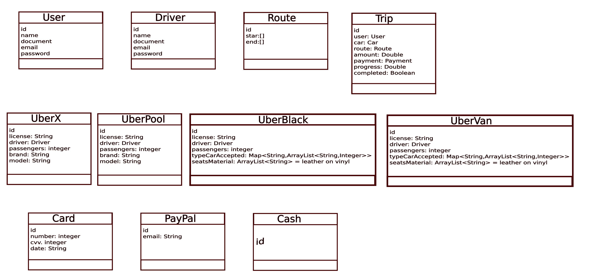

Todos los atributos de **User y Driver** son iguales por tanto se puede sacar una **Súperclase** padre llamada **Account**

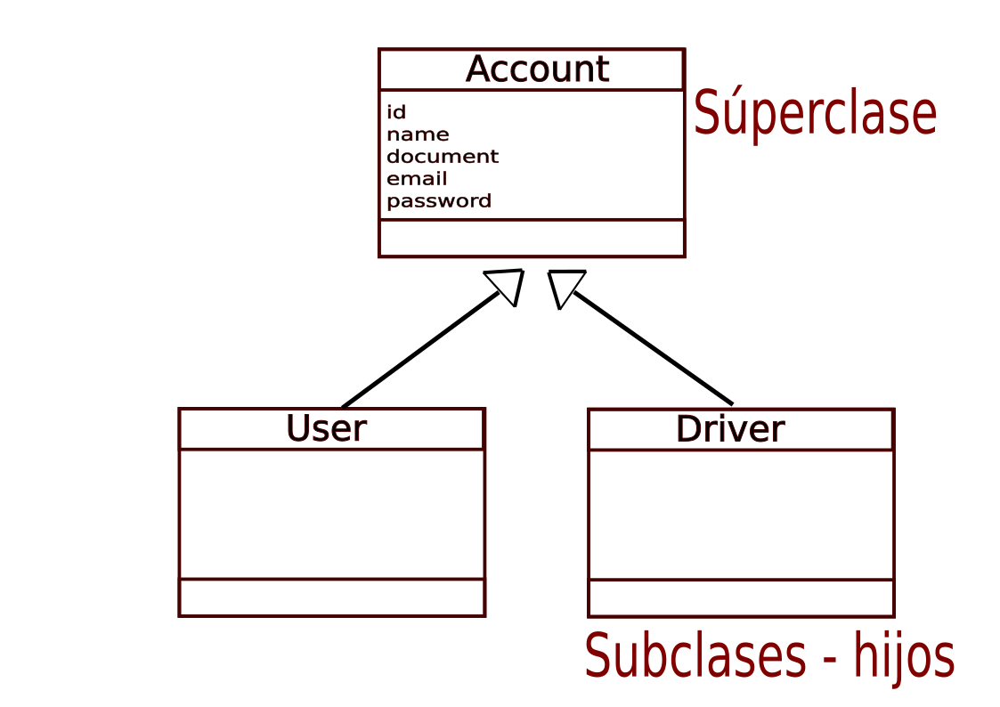

Tambien se puede realizar la parte de pagos

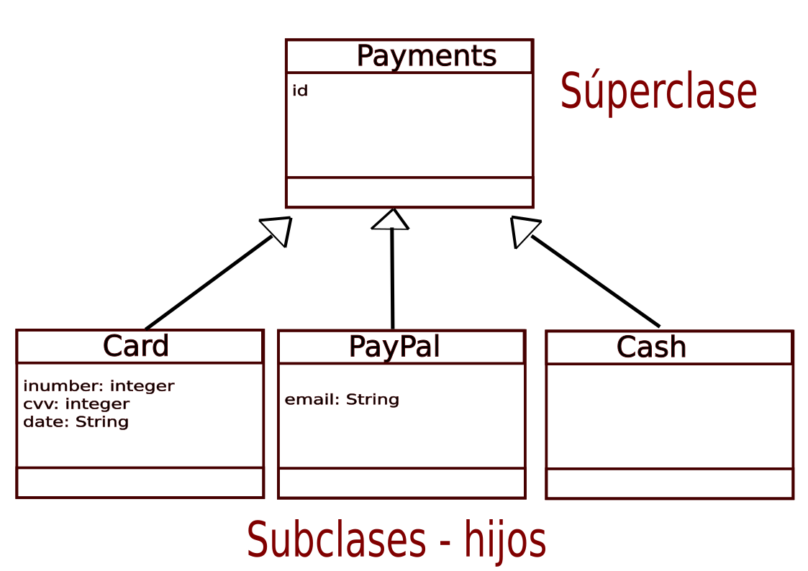

y por ultimo la parte de los vehiculos Uber

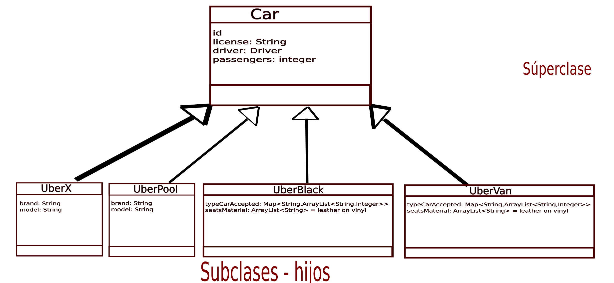

Por ultimo este es el modelo simplificado del sitema Uber

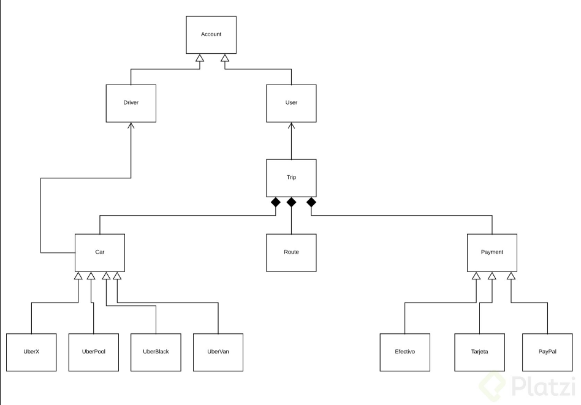

## Clase 17 Reto 2: analicemos un problema

Imagina que nuestro sistema de adopciones creció y ahora ofrece adoptar pericos, loros, gatos y hamsters.

Genera un nuevo análisis, aplica herencia para abstraer mejor el problema y lograr modularidad en el software.

- Lo primero que se hace es definir las clases u objetos que van a existir

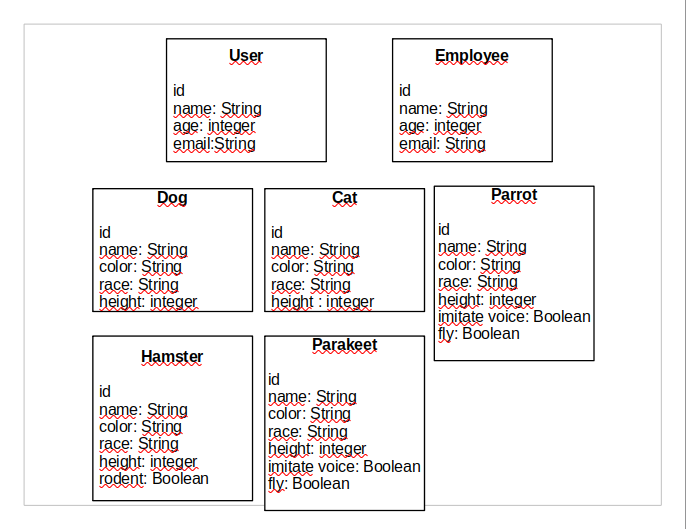

Ahora se observa y se reduce todo a superclase determinando atributos en comun que puedan tener cada uno de los objetos

primero se empiezan por las personas 

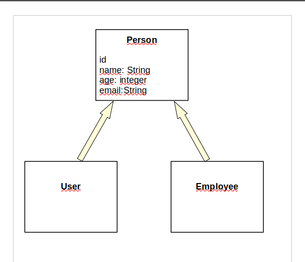

Despues con los animales clasificandolos como domesticos

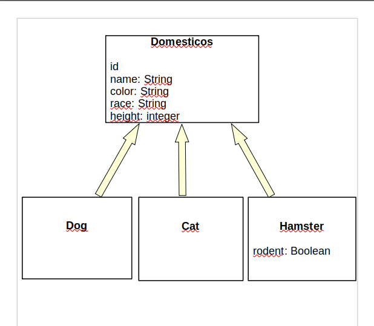

y los que son aves silvestres

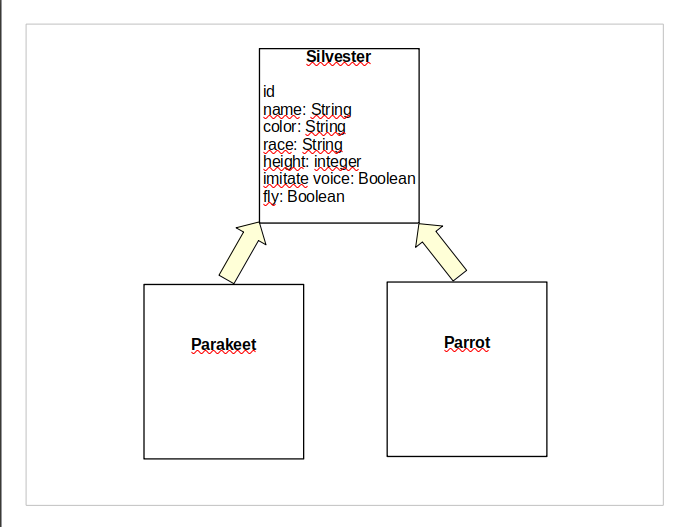

## Clase 18 Definiendo clases en Java y Python

A continuacion sigue la etapa de programacion del proyecto Uber 

Abrir la carpeta **CursoPOOUber/Java** y dentro de esta crear un archivo que se llame **Main.java**

y alli agregar el siguiente codigo 

```
class Main {
    
    public static void main(String[] args) {
        System.out.println("Hola Mundo");
    }
}
```

En caso de que no llegue a funcionar el compilador del codigo abrir la terminal y ubicar la carpeta. 

En mi caso es **Cursos-platzi/POO/CursoPOOUber/Java** y despues ejecutar

`java Main.java`

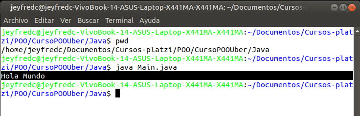

Esto se hace para realizar una prueba y ver que este ejecutando de manera correcta el codigo

Dentro de la carpeta Java crear el archivo **Account.java** y para crear la clase debe llevar el mismo nombre del documento

```
class Account {
    Integer id;
    String name;
    String document;
    String email;
    String password;
}
```

Ahora se crea la siguiente clase, dentro de la carpeta Java crear el archivo **Car.java**

```
class Car{
    Integer id;
    String license;
    String driver;
    Integer passenger;
}
```

la siguiente clase es Payment, dentro de la carpeta Java crear el archivo **Payment.java**

```
class Payment{
    Integer id;
}
```

Por ultimo se crea la clase Route, dentro de la carpeta Java crear el archivo **Route.java**

```
class Route {
    Integer id;
    ArrayList<Double> start;
    ArrayList<Double> end;
}
```

Ahora continua con la carpeta **Python** en **/Cursos-platzi/POO/CursoPOOUber/Python** y alli crear el archivo **main.py**

```
if __name__ == "__main__":
    print("Hola mundo")
```

Nuevamente en la terminal ubicar la carpeta Python y ahora para ejecutar el archivo ejecutar

`Python3 main.py`

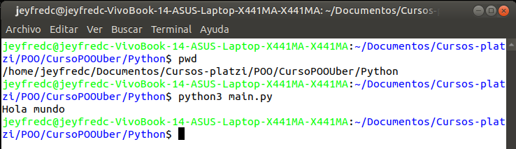

Nuevamente se crean las clases para python.

Dentro de la carpeta Python crear el archivo **account.py**

```
class Account:
    id = int
    name = str
    document = str
    email = str
    password = str
```

Ahora se crea la siguiente clase, dentro de la carpeta Python crear el archivo **car.py**

```
class Car:
    id = int
    license = str
    driver = str
    passenger = int
```

la siguiente clase es Payment, dentro de la carpeta Python crear el archivo **payment.py**

```
class Payment:
    id = int
```

Por ultimo se crea la clase Route, dentro de la carpeta Python crear el archivo **route.py**

```
class Route:
    id = int
    start = [] 
    end = []
```

## Clase 19 Definiendo Clases en JavaScript

Si estás interesado en aprender JavaScript desde ahora debes saber que el concepto de clases no existía como tal hasta el nuevo estándar EcmaScript 6. El reto de encontrar sistemas construidos con este estándar es alto por esa razón te explicaré cuál fue por mucho tiempo su equivalente.

Los Prototipos fue la forma de crear clases en JavaScript y las representaremos partiendo de la declaración de una función.

Creemos nuestras clases:

- Account

- Car

- Payment

- Route

Para esto crearemos el siguiente sistema de archivos dentro de la carpeta JS de nuestro proyecto:

- Account.js

- Car.js

- Payment.js

- Route.js

- index.js

El archivo index.js será el lugar equivalente al punto de entrada de la aplicación donde estaremos declarando nuestros objetos basado en las clases. Para esta clase lo dejaremos en blanco.

Ahora veamos el código archivo por archivo:

**Account.js**

```
function Account() {
    this.id;
    this.name;
    this.document;
    this.email;
    this.password;
    
}
```

**Car.js**

```
function Car () {
    this.id;
    this.license;
    this.driver;
    this.passenger;
    
}
```

**Payment.js**

```
function Payment() {
    this.id;
    
}
```

**Route.js**

```
function Route() {
    this.id;
    this.init;
    this.end;
    
}
```

Este es el enlace del código del proyecto: https://github.com/anncode1/Curso-POO-Platzi/tree/f5725787165b36cae579f94e428068039b554b0b/JS

En este código notarás el uso de la palabra reservada this. Normalmente cuando usamos la sintaxis punto siempre lo haremos a partir de un objeto instanciado, en este caso con this, se hace una simulación al objeto en cuestión, a pesar de que en ese momento visualmente sigue siendo una clase.

```
function Route() {
    this.id;
    this.init;
    this.end;
    
}
```

Digamos que se adelanta un poco al momento de ejecución y visualiza al objeto con sus atributos, más adelante verás la forma en que podemos asignar datos a un atributo del objeto en otros lenguajes y verás que es exactamente la misma sintaxis.

Si intentaramos poner this. en el momento de ejecución nos traería un listado de todos los componentes de la clase que en este caso son solo estos tres: id, init y end.

This hace referencia al objeto instanciado. Para comprender del todo esta última frase mira la siguiente clase donde hablamos de objetos.

**Reto.**
En la carpeta de nuestro proyecto PHP declara estas mismas clases

## Clase 20 Objetos, método constructor y su sintaxis en código

Los **objetos** nos ayudan a crear instancia de una clase, el objeto es el resultado de lo que modelamos, de los parámetros declarados y usaremos los objetos para que nuestras clases cobren vida.

Para el caso de **Java** crear una instancia de una clase se hace de la siguiente forma

```
Person person = new Person();
```

**Person** hace referencia a la Clase creada 

**person** es el nombre o instancia del objeto proveniente de la clase, es el objeto que adquiere todos los atributos de la clase **Person**

**new Person()** hace referencia al metodo constructor de la clase, su representacion en todos los casos es finalizando con un parentesis **()** los metodos van escritos con la primer letra mayuscula y tienen el mismo nombre de la clase que es **Person()**

El **Metodo constructor** tiene la siguiente funcionalidad:

- Dar un estado inicial al objeto

- Tiene el mismo nombre de la clase

- Son los parametros minimos que necesita el objeto para que pueda vivir

A continuacion la formas de crear instancias en los otros lenguajes

**Python**

```
persona = Person()
```

**JavaScript**

```
var person = new Person();
```

**PHP**

```
$person = new Person();
```

Los **métodos constructores** dan un estado inicial al objeto y podemos añadirle algunos datos al objeto mediante estos métodos. Los atributos o elementos que pasemos a través del constructor serán los datos mínimos que necesita el objeto para que pueda vivir.

En el caso de **Java** lo primero que va es el modificador de acceso **public**, seguido del nombre del metodo que es el mismo nombre de la clase el cual es **Person**, despues vienen los atributos, en Java debe ser declarado el tipo de variable o atributo y para tener acceso al objeto se hace mediante la sentencia **this.atributo**

**Java**

```
public Person(String name){
    this.name = name;
}
```

**JavaScript**

```
function Person(name){
    this.name = name
}
```

Python el metodo constructor es declaro con **def __init__** y para tener acceso al atributo se hace mediante la palabra **self**

**Python**

```
def __init__(self,name):
    self.name = name
```

PHP el metodo constructor es con **function__construct**

**PHP**

```
public function__construct($name) {
    $this->name=name;
}
```

la forma en la que se llaman los objetos para pasar parametros seria lo siguiente

**Java**

`Person person = new Person("Jeyfred");`

**JavaScript**

`var person = new Person("Jeyfred");`

**Python**

`person = Person("Jeyfred")`

**PHP**

`$person = new Person("Jeyfred");`

## Clase 21 Objetos. Dando vida a nuestras clases en Java y Python

Abrir el archibos **Main.java** para empezar a instanciar cada una de las clases creadas en clase anteriores

Aqui se hace instancia de la clase **Car**, para acceder a cada uno de sus atributos se usa el nombre del objeto seguido de un punto **car.** y el nombre del metodo, estos pueden ser accedidos porque el modificador de acceso en la clase es publico

```
class Main {
    
    public static void main(String[] args) {

        Car car = new Car();
        car.license = "AMQ123";
        car.driver = "jeyfred Calderon";
        car.passenger = 4;
        System.out.println("Car License" + car.license);
    }
}
```

Y para crear otro objeto de la clase Car se hace de la misma forma

```
class Main {
    
    public static void main(String[] args) {
        System.out.println("Hola Mundo");
        Car car = new Car();
        car.license = "AMQ123";
        car.driver = "jeyfred Calderon";
        car.passenger = 4;
        System.out.println("Car License" + car.license);
    }
}
```

al instanciar otro objeto de la clase se agrega lo siguiente 

```
class Main {
    
    public static void main(String[] args) {
        System.out.println("Hola Mundo");
        Car car = new Car();
        car.license = "AMQ123";
        car.driver = "jeyfred Calderon";
        car.passenger = 4;
        System.out.println("Car License" + car.license);

        Car car2 = new Car();
        car2.license="JRM45E";
        car2.driver="Andres Gonzalez";
        car2.passenger = 3;
        System.out.println("Car License" + car2.license);
    }
}
```

En caso que no funcione en la terminal ni tampoco en Vs Code se puede descargar el IDE de Java o Eclipse, en el caso de Ubuntu, tener en cuenta que se debe descargar JDK(Java Developer Kit) y JRE(Java Runtimes Environment) en las versiones actuales

https://www.solvetic.com/tutoriales/article/8579-como-instalar-eclipse-ide-ubuntu-21-10-y-20-04/

despues de ejectutar el archivo debe salir 

Hola Mundo
Jeyfred Calderon 
Car License AMQ123
Car License JRM45E

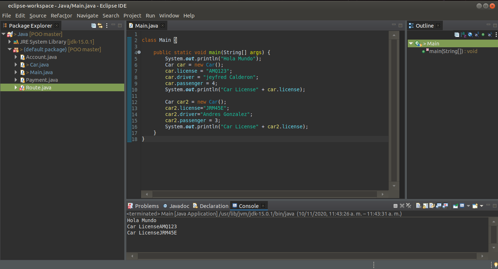

Esta es una forma de imprimir datos pero no es tan eficiente y hace que se deba colocar mas lineas de codigo por tanto existen los metodos.

Abrir el archivo **Car.java**

y añadir el metodo 

```
void printDataCar(){
    System.out.println("License: " + license + " Driver: " + driver);
}
```
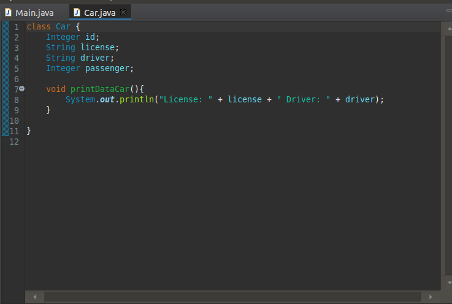

y nuevamente pasar al archivo **Main.java** para llamar al metodo en este caso se edita el archivo de la siguiente forma

```
class Main {
    
    public static void main(String[] args) {
        System.out.println("Hola Mundo");
        Car car = new Car();
        car.license = "AMQ123";
        car.driver = "jeyfred Calderon";
        car.passenger = 4;
        car.printDataCar();

        Car car2 = new Car();
        car2.license="JRM45E";
        car2.driver="Andres Gonzalez";
        car2.passenger = 3;
        car2.printDataCar();
    }
}
```

al ejecutar el compilador van a aparecer los atributos que fueron declarados en el metodo de la clase y en **Main.java** lo que se esta llamando es al metodo de la clase 

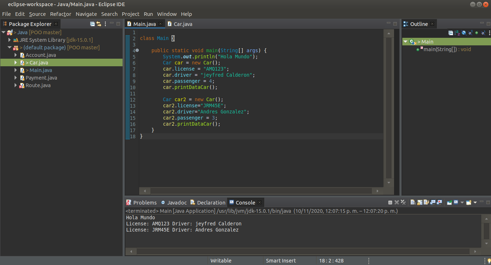

Para realizar esto mismo con Python abrir **main.py**

lo primero que se debe hacer es importar la clase con la siguiente sentencia **from car import Car** y despues realizar la instancia en este caso es mas facil llamar al objeto de la clase y declarar los atributos

```
from car import Car

if __name__ == "__main__":
    print("Hola mundo")
    
    car = Car()
    car.license = "JRM45E"
    car.driver = "Jeyfred Calderon"
    print(vars(car))

```

Para imprimir los datos se abre la terminal y se ejecuta 

`Python3 main.py`

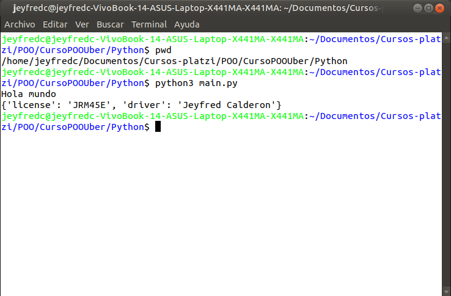

Si se quiere crear el otro objeto 

```
from car import Car

if __name__ == "__main__":
    print("Hola mundo")

    car = Car()
    car.license = "JRM45E"
    car.driver = "Jeyfred Calderon"
    print(vars(car))

    car2 =Car()
    car2.license = "AMQ123"
    car2.driver= "Andres Gonzalez"
    print(vars(car2))
```

y luego ejecutar en la terminal

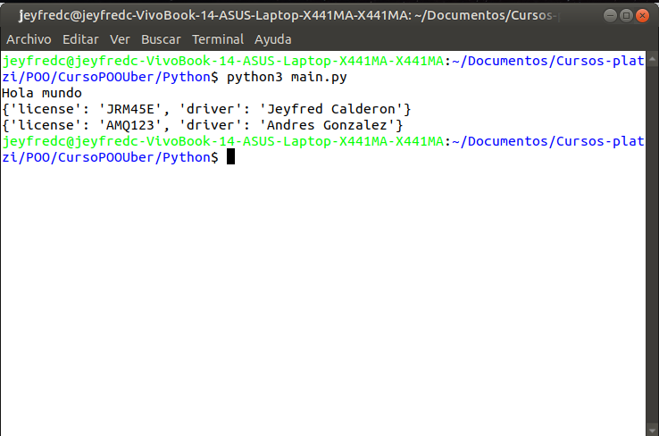

## Clase 22 Declarando un Método Constructor en Java y JavaScript

Ahora con el lenjuage **Java** se van a empezar a contruir en cada una de las clases el metodo constructor, para esto abrir **Car.java** y colocar el metodo **public Car()**, lo que va dentro de los parentesis son los parametros los cuales van a obligar que para que sea creado un objeto **Car** debe contener los mismos parametros del metodo constructor, estos parametros obligatorios seran la licencia y el conductor, como estaba el diagrama se habia indicado que Car heredaba de la clase Account por tanto se cambia la palabra String por Account

```
class Car {
    Integer id;
    String license;
    Account driver;
    Integer passenger;

    public Car(String license, Account driver){
        this.license = license;
        this.driver = driver;

    }

    void printDataCar(){
    System.out.println("License: " + license + " Driver: " + driver);
    }

}
```
**Nota:** el nombre de license y driver que esta en los parametros puede tener cualquier tipo de nombre, es decir se podria llamar license2 y driver2, si se hiciera asi no habria necesidad de colocar **this.** quedaria de la siguiente forma `license = license2;`, pero es una mala practicar realizarlo de esta forma y por tanto en la mayoria de los casos se va a encontrar como la estructura del metodo, indicando que **this.** hace referencia a la clase, es decir a la clase Car

```
    public Car(String license, Account driver){
        this.license = license;
        this.driver = driver;

    }
```

Si no se modifica nada mas el programa no se va a ejecutar porque ya se pasaron unos parametros para el metodo constructor de la clase Car y es que es obligatorio pasar la licencia y el conductor

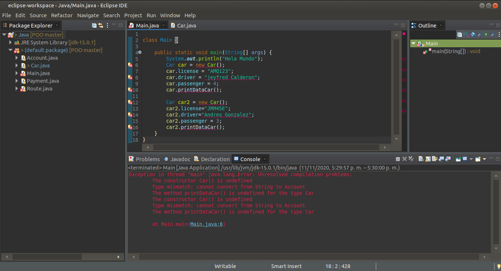

en la parte de abajo se indica que el constructor de la clase Car no esta definida, ahora se debe pasar los parametros obligatorios al objeto car que es la licencia y el conductor.

```

class Main {
    
    public static void main(String[] args) {
        System.out.println("Hola Mundo");
        Car car = new Car("AMQ123", );

        car.driver = ;
        car.passenger = 4;
        car.printDataCar();

        Car car2 = new Car("JRM45E");
        car2.driver="Andres Gonzalez";
        car2.passenger = 3;
        car2.printDataCar();
    }
}
```

Todavia no funciona porque no se ha creado un metodo constructor para la clase **Account.java** por tanto se crea el metodo constructor con los parametros que se consideren necesarios

```
class Account {
    Integer id;
    String name;
    String document;
    String email;
    String password;

    public Account(String name, String document){
        this.name = name;
        this.document = document;
    }
}
```
 
Nuevamente se modifica **Main.java**, ahora si se pueden pasar el parametro que hace falta de la siguiente forma

```
class Main {
    
    public static void main(String[] args) {
        System.out.println("Hola Mundo");
        Car car = new Car("AMQ123", , new Account("Jeyfred Calderon", "JCC1004"));
        car.passenger = 4;
        car.printDataCar();

        Car car2 = new Car("JRM45E", new Account("Andrez Gonzalez", "ANDD123"));
        car2.passenger = 3;
        car2.printDataCar();
    }
}
```

Falta algo mas por corregir, si se ejecuta por el momento solo se va a imprimir esto y no esta trayendo los datos de manera correcta

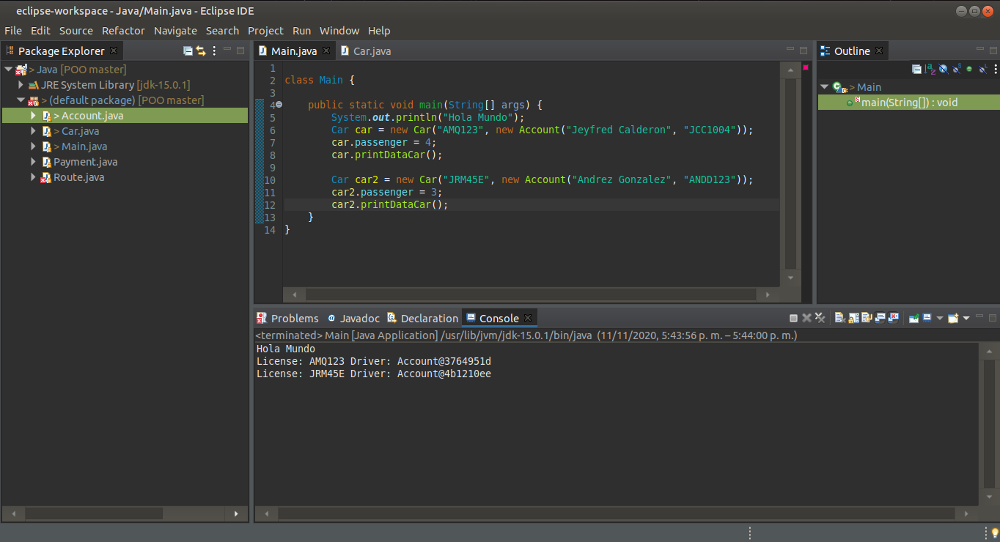

Para corregir los datos de Driver hay que abrir el archivo **Car.java** y añadir el atributo name a driver en el metodo **printDataCar**

```
class Car {
    Integer id;
    String license;
    Account driver;
    Integer passenger;

    public Car(String license, Account driver){
        this.license = license;
        this.driver = driver;
        
    }

    void printDataCar(){
        System.out.println("License: " + license + " Driver: " + driver.name);
    }

}
```

Ejecutar **Main.java** nuevamente para que ahora si se muestren los datos

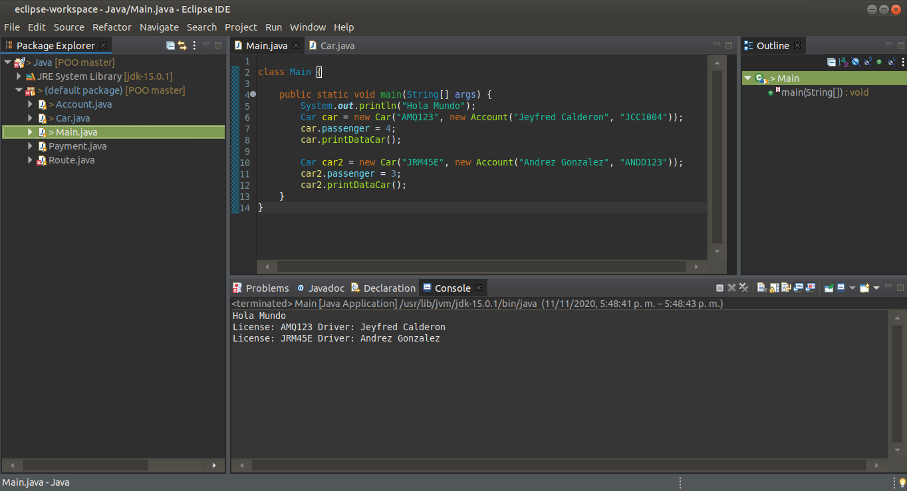

___

Ahora se va a realizar lo mismo con JavaScript

En el folder **JS** crear un archivo que se llame **index.html** 

el cual contendra lo siguiente

```
<!DOCTYPE html>
<html lang="en">
<head>
    <meta charset="UTF-8">
    <meta name="viewport" content="width=device-width, initial-scale=1.0">
    <title>Document</title>
</head>
<body>
    <h1>Programacion Orientada a Objetos en JavaScript</h1>
</body>
<script src="Account.js"></script>
<script src="Car.js"></script>
<script src="index.js"></script>
</html>
```

Anteriormente en JavaScript esta era la forma de crear el metodo constructor. Empezando por el archivo **Car.js**

```
function Car (license, driver) {
    this.id;
    this.license = license;
    this.driver = driver;
    this.passenger;
    
}

Car.prototype.printDataCar = function () {
    console.log(this.driver)
    console.log(this.driver.name)
    console.log(this.driver.document)
}
```

Ahora abrir el archivo **Account.js** para agregar el metodo constructor

```
function Account(name, document) {
    this.id;
    this.name = name;
    this.document = document;
    this.email;
    this.password;
    
}
```

En el mismo folder **JS** crear otro archivo llamado **index.js**, este archivo sera el que llame el resto de clases creadas en el folder 

```
var car = new Car("AMQ123", new Account("Jeyfred Calderon", "JCC1004"))
car.passenger = 4;
car.printDataCar();
```

Ahora abrir el archivo **index.html** en Visual Studio Code se puede instalar una extension llamada LiveServer, luego seleccionar el archivo dar click derecho y seleccionar **Open with Live Server**

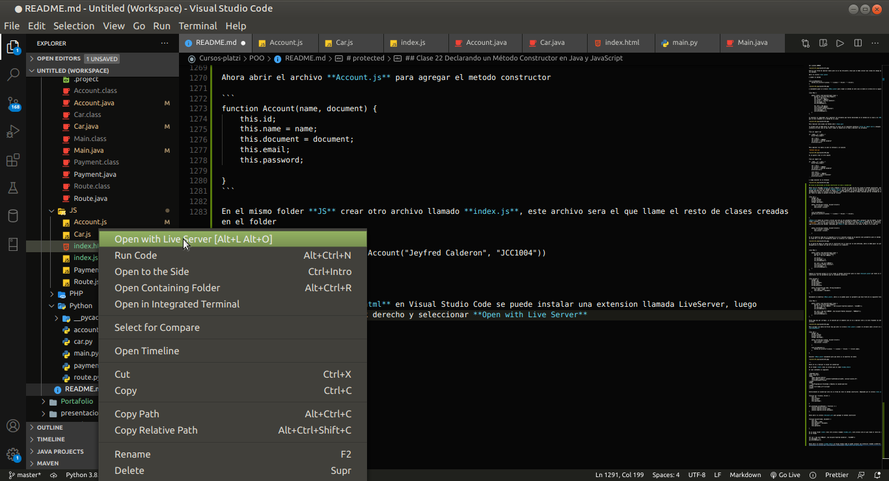

Automaticamente se va a abrir el navegador Chrome y luego cuando este seleccionado el navegador presionar en el tecla **ctrl + shift + i**

alli se va a abrir un panel, seleccionar el que dice **Console** y a continuacion ya se va a mostrar lo que se ha declarado en el objeto car 

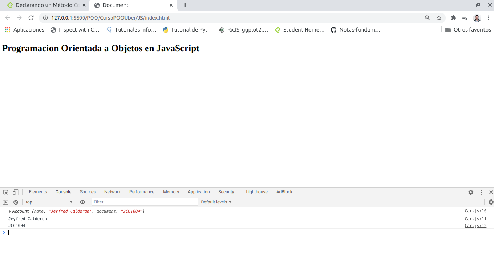

la nueva forma de construir clases en JavaScript seria de la siguiente forma

archivo **Car.js**

```
/* function Car (license, driver) {
    this.id;
    this.license = license;
    this.driver = driver;
    this.passenger;
    
} 

    Car.prototype.printDataCar = function () {
    console.log(this.driver)
    console.log(this.driver.name)
    console.log(this.driver.document)
} */ 


class Car {
    constructor (license,driver){
        this.license = license
        this.driver = driver
        this.id
        this.passenger
    }

printDataCar = () => {
    console.log(this.driver)
    console.log(this.driver.name)
    console.log(this.driver.document)
    }
}
```

archivo **Account.js**

```
/* function Account(name, document) {
    this.id;
    this.name = name;
    this.document = document;
    this.email;
    this.password;
    
} */

class Account{
    constructor(name, document){
        this.id
        this.name = name
        this.document = document
        this.email
        this.password
    }
}
```

Esta es la forma que establece EcmaScript 6

los datos se seguiran cargando de la misma forma


## Clase 23 Declarando un Método Constructor en Python

En Python encontrarás un concepto denominado Métodos Mágicos, estos métodos son llamados automáticamente y estrictamente bajo ciertas reglas. El método constructor en Python forma parte de esta familia de métodos y como aprendimos en la clase anterior lo declaramos usando `__init__`, aunque si nos ponemos estrictos este método no construye el objeto en sí. El encargado de hacer esto es `__new__` y el método `__init__` se encargará de personalizar la instanciación de la clase, esto significa que lo que esté dentro de `__init__` será lo primero que se ejecute cuando se cree un objeto de esta clase.

Para nuestro proyecto tenemos la necesidad de que algunas variables se inicialicen obligatoriamente cuando ocurra la instanciación. Así que declaremos el método `__init__` en las clases de nuestro proyecto con las propiedades obligatorias.

Para la clase Account quedaría algo así, notarás que usamos la palabra clave self, esta es muy parecida a lo que venimos trabajando a otros lenguajes con this. Y como su nombre lo dice hace referencia a los datos que componen la clase, en este caso self.name está llamando al atributo name que se encuentra en la línea 3 de la clase y, le está asignando el dato que se pasa en el método `__init__` de la línea 8.

```
class Account:
    id = int
    name = str
    document = str
    email = str
    password = str


    def __init__(self, name,document):
        self.name = name
        self.document = document
```

Ahora veamos la clase Car:

```
from account import Account

class Car:
    id = int
    license = str
    driver = Account("", "")
    passenger = int

    
    def __init__(self, license, driver):
        self.license = license
        self.driver = driver
```

Lo que notarás de diferente es que cambiamos el tipo de dato de driver, ahora es de tipo Account y como ves está solicitando los dos datos obligatorios para instanciar un objeto de este tipo. Esto lo verás más en acción en el próximo fragmento de código del archivo **main.py**. Además, mucho ojo, en la primera línea observamos que es importante importar la clase para poderla usar.

Nuestro archivo **main.py** ahora se verá así:

```
from car import Car
from account import Account

if __name__ == "__main__":
    print("Hola mundo")

    car = Car("JRM45E", Account("Jeyfred Calderon", "JCC1004"))
    print(vars(car))
    print(vars(car.driver))
```

Observa que estamos importando las dos clases que usaremos y las estamos instaciando en los métodos constructores.

Los resultados serán los siguientes:

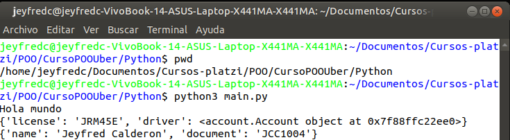

**Nota:** como reto queda pendiente por completar las otras clases de JavaScript y de PHP.

Cualquier duda se pueden observar los archivos en el repositorio